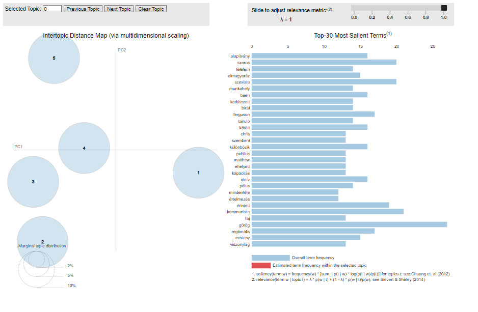
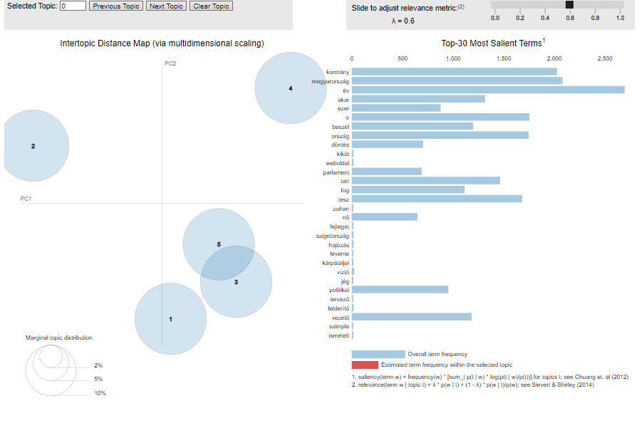
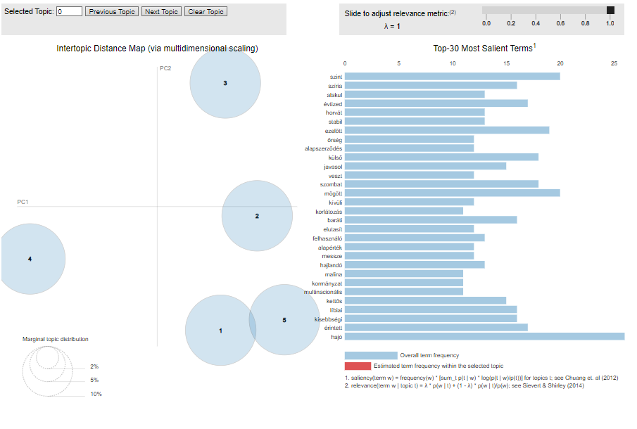
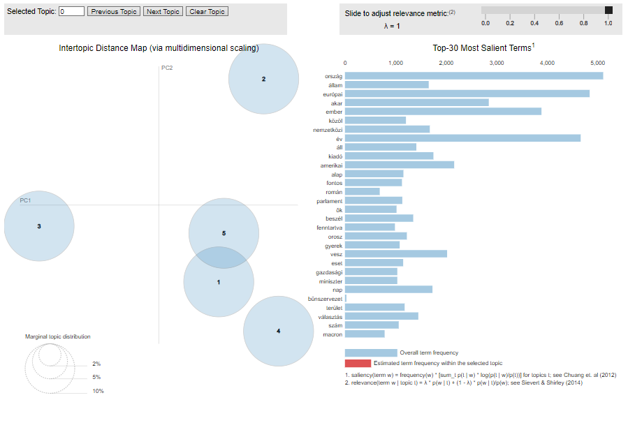
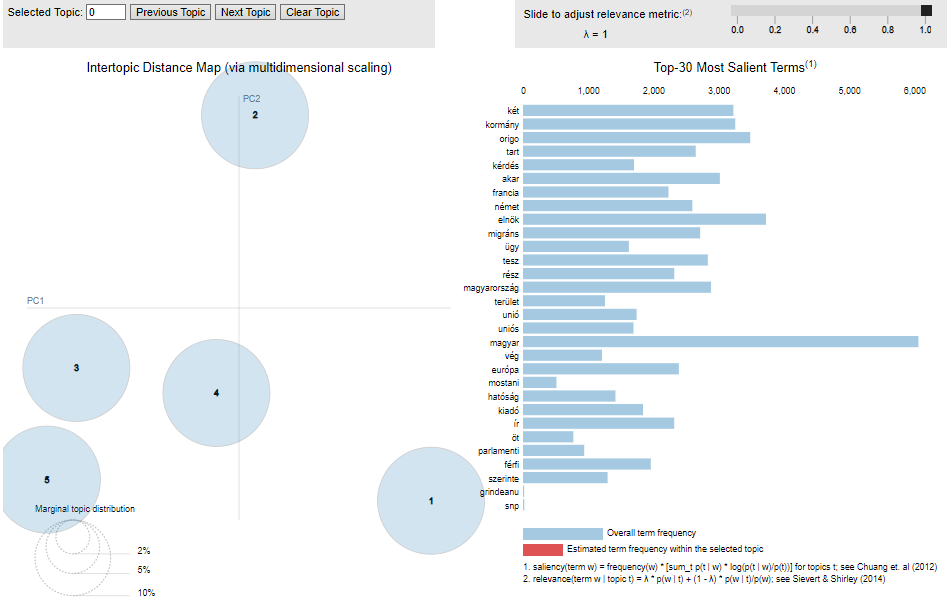
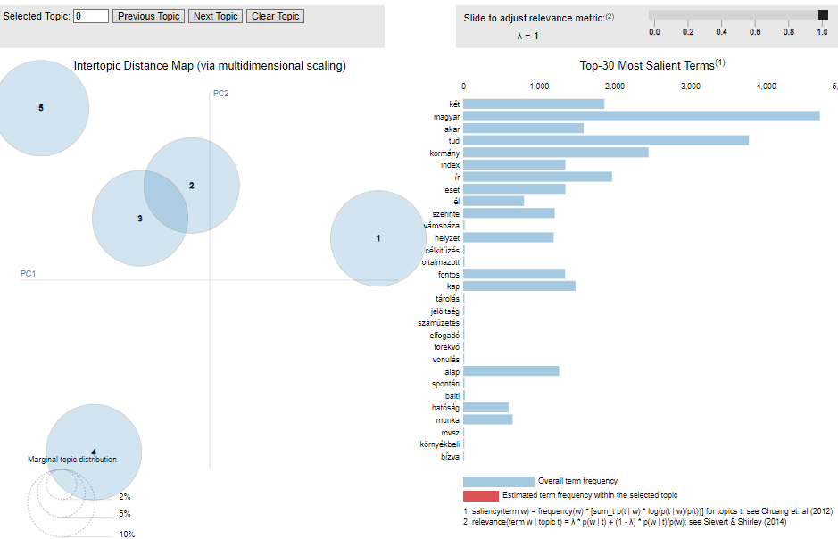

# brrrrrr12.github.io

This page contains information and data related to various topics.

## Elért dokumentumok évenként

This section contains documents organized by year.

### Témák elhelyezkedése és megoszlása 2010 és 2020 között egyes portálokon
## Az egyes körök azt mutatják, mekkora egy téma, elhelyezkedésük az egymástól való messzeségüket. A jobboldalon az első 30 legkifejezőbb szó látható. 
#interaktív felületért katt a képre!

# egymás mellett

<table style="border-collapse: separate; border-spacing: 55px; padding: 55px;">
  <tr>
    <td>
      
    </td>
    <td>
      
    </td>
  </tr>
  <tr>
    <td>
      
    </td>
    <td>
      
    </td>
  </tr>
</table>

This section shows the distribution of topics on different portals between 2010 and 2020.

Egymás után

- [444](./444_2010-2019_teljes_kopusz.html)
- 
- [Index](./index_2010-2019_teljes_kopusz.html)
- 
- [Mandiner](./mandinder_2010-2019_teljes_kopusz.html)
- 
- [Origo](./origo_2010-2019_teljes_kopusz.html)
- 

## Témák megoszlása kormányközeli és nem kormányközeli portálokon

This section shows the distribution of topics on government-affiliated and non-government-affiliated portals.

- 
- 
